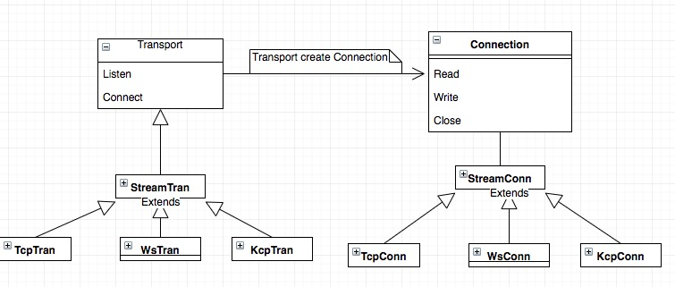

# Fairy library(WIP)

模仿netty,mina,grizzly，用go语言实现的一套网络库，api的设计上更接近于grizzly,为了方便游戏开发，除了网络模块，还有一些其他辅助功能，比如table,log,container等

## 一:使用

```go
package chat

import (
    "fairy"
    "fairy/codec"
    "fairy/filter"
    "fairy/frame"
    "fairy/identity"
    "fairy/log"
    "fairy/tcp"
)

type ChatMsg struct {
    Content string
}

func StartServer() {
    log.Debug("start server")
    // step1: register message
    fairy.RegisterMessage(&ChatMsg{})

    // step2: register handler
    fairy.RegisterHandler(&ChatMsg{}, func(conn fairy.Conn, pkt fairy.Packet) {
        req := pkt.GetMessage().(*ChatMsg)
        log.Debug("client msg:%+v", req.Content)

        rsp := &ChatMsg{}
        rsp.Content = "welcome boy!"
        conn.Send(rsp)
    })

    // step3: create transport and add filters
    tran := tcp.NewTransport()
    tran.AddFilters(
        filter.NewLog(),
        filter.NewFrame(frame.NewLine()),
        filter.NewPacket(identity.NewString(), codec.NewJson()),
        filter.NewExecutor())

    // step4: listen or connect
    // if client side,just need replace this line to
    // tran.Connect("localhost:8080", 0)
    tran.Listen(":8080", 0)

    // step5: wait finish
    fairy.WaitExit()
}
```

## 二:原理

- Transport和Connection
  - Transport:主要提供Listen和Connect两个接口,用于创建Connection,Connection默认会自动断线重连，如果不需要断线重连,需要设置Transport配置,tran.SetConfig(fairy.CfgReconnectCount, 0)
  - Connection:类似于net.Conn，主要提供Read，Write，Close等接口，区别是读写是异步完成的

 

- FilterChain和Filters
  - filter分为InBound和OutBound两种流向,类似grizzly
    - InBound: HandleRead,HandleOpen,HandleError
    - OutBound:HandleWrite,HandleClose
  - 内置的filters
    - FrameFilter,PacketFilter,ExecutorFilter,LoggingFilter,TelnetFilter,ConnectFilter
    - 自定义filter
      - filter应该是一个无状态的类
      - 如果需要数据，可以有两种方式：临时Filter之间传递数据，可以存储在FilterContext中,长期持有的,可以存储在Connection中
  - Error处理:默认error会自动Close Connection,如果不需要Close,需要自定义一个Filter拦截，返回StopAction即可


- 消息的编解码
  - 在大部分应用中，消息的编解码是主要的通信工作，我这里划分了以下几个概念，Frame，Packet(Identity,Codec)
    - Frame:用于消息的粘包处理，例如类似http协议，以\r\n分隔，或者以固定长度的头标识后边消息长度
    - Packet:消息包内容，通常分为两个部分，消息头和消息体,分别用Identity和Codec表示
      - Identity:用于消息头的编解码并创建具体的Packet
        1. 两个字节标识消息ID
        2. 冒号分隔字符串标识消息名
        3. 服务器内部通信，还需要uid，reqid等
        4. 自定义消息头，需要实现两个部分,实现Packet接口和Identity接口
      - Codec:   用于消息体的编解码,例如json,protobuf

- 线程模型
  - 本库并没有强制约定线程的使用,但也提供了一些常用功能
    - 大部分应用都是多网络线程+1个逻辑线程的模式,因此提供了Exector和ExectorFilter两个类，只要添加到FilterChain末尾则可以实现单逻辑线程模式
    - Executor可以不止一个线程，比如:某些复杂但又独立的业务操作，可以在注册消息回调时制定一个queueIndex,则可以实现该模块在独立的线程中执行，但要使用者自己保证线程安全
    - Executor还提供了一个Go方法，他的功能是某个协程函数执行结束后，会在主线程中回调一个函数
  - 每个Connection都有自己的读写线程,
    - InBound在Connection的读线程中处理,直到转发到ExectorFilter逻辑线程中处理
    - Outbound在调用线程中处理,直到发送字节流时转到Connection的写线程中
  - 其他线程：Timer线程，Executor线程,Log线程等,
    - log线程需要注意的是属性的初始化是非线程安全的，需要在主线程中设置属性，启动后将不能再修改
    - timer线程默认会将处理函数放到逻辑线程(Executor)中调用,如果不需要放到逻辑线程，可以将TimerEngine中的exector设置为nil
  - 非线程安全，启动时需要注册好的类
    - registry
    - dispatcher

- 其他辅助类
  - buffer:底层的数据流存储，使用list存储[]byte，数据非连续的，可以像stream一样操作数据,使用时需要注意当前位置，以及哪些函数会影响当前位置
  - registry:非线程安全,用于消息的注册，可通过名字，或者id注册查询，也可以通过类型查询名字和id
  - dispatcher:非线程安全,handler的注册和查询
  - table:csv,tsv表格加载

- 辅助工具可参考
  - protobuf: https://github.com/jeckbjy/tool-proto-gen
  - 导表工具:  https://github.com/jeckbjy/tool-table-gen

- 依赖库
  - fairy:不依赖任何库,但集成了一些开源库
    - inlist: github.com/ionous/container/inlist
    - shortid:github.com/teris-io/shortid
    - sonyflake:https://github.com/sony/sonyflake
    - go-colortext:github.com/daviddengcn/go-colortext
  - fairy-kcp:依赖 github.com/xtaci/kcp-go
  - fairy-protobuf: 依赖 github.com/golang/protobuf
  - fairy-websocket: 依赖 github.com/gorilla/websocket

- 参考框架
  - cellnet: https://github.com/davyxu/cellnet 
    - 功能很完善的go服务器框架，扩展性也还不错,支持websocket,tcp,kcp,以及各种编码协议,整体设计上还是很不错的服务器框架
  - leaf: https://github.com/name5566/leaf
    - 一个扩展性非常低go服务器框架,支持websocket,tcp以及protobuf，json编码，但架构设计上耦合太严重
